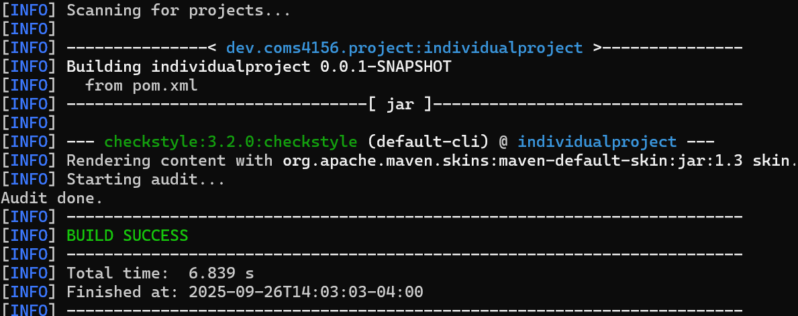
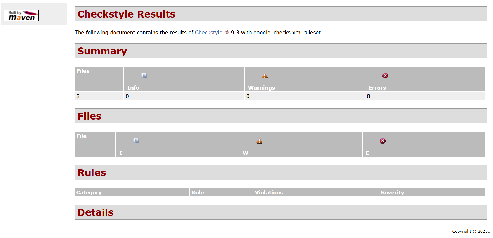
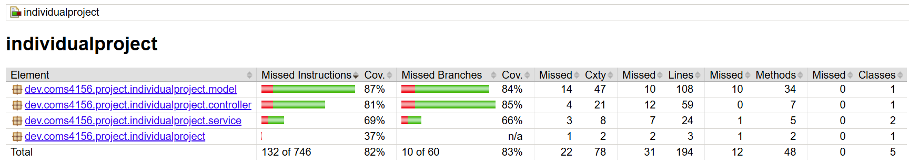
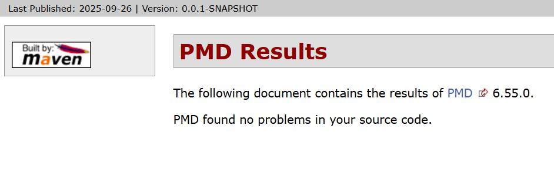

# Library Management
This is the GitHub repository for the COMS-4156 Individual Project.

## Viewing the Client App Repository
Please use the following link to view the repository relevant to the app: https://github.com/krn2125/COMSW4156_lab3.git

## Building and Running a Local Instance
Install the following tools:

1. Maven 3.9.5:  
https://maven.apache.org  
Follow the installation instructions for your OS. For Windows, add Maven's bin directory to system PATH variables. For macOS or Linux, follow the instructions in Maven's README.
2. JDK 17:  
https://www.oracle.com/java/technologies/javase/jdk17-archive-downloads.html  
This project was developed using JDK 17.0.12.
3. IntelliJ IDE:  
https://www.jetbrains.com/idea/download/?section=windows  
IntelliJ is recommended, but any Java IDE works.

## Setup Instructions
1. Clone the repository:  
git clone https://github.com/krn2125/COMSW4156_lab3.git  
cd IndividualProject
2. Build the Project:  
mvn clean install
3. Run the application:  
mvn spring-boot:run

### Running Tests in IntelliJ
1. Right-click any test class within the tests folder
2. Select "run ClassName"

## Endpoints
Base URL: http://localhost:8080

### GET/
- Description: Welcome page
- Response: Welcome message

### GET/book/{id}
- Description: Retrieve books details by ID
- Parameters:
  - id (path): Book ID (int)
- Success Response: 200 or OK with Book object
- Error Response: 404 or NOT_FOUND if book does not exist

### GET/books/available
- Description: Get all books with available (non-checked-out) copies
- Success Response: 200 or OK with list of available books
- Error Response: 500 or INTERNAL_SERVER_ERROR 

### PATCH/book/{bookID}/add
- Description: Add a copy of a specific book to the library
- Parameters:
  - id (path): Book ID (int)
- Success Response: 200 or OK with updated Book
- Error Response: 404 or NOT_FOUND if book does not exist, or 500 INTERNAL_SERVER_ERROR if failure

### GET/books/recommendation
- Description: Get 10 recommended books, comprised of five popular and five random suggestions
- Success Response: 200 or OK with list of 10 books
- Error Response: 500 or INTERNAL_SERVER_ERROR if less than 10 books exist in the library

### GET/checkout
- Description: Checkout a boook
- Parameters:
  - id (path): Book ID (int)
- Success Response: 200 or OK with checked-out book
- Error Response: 404 or NOT_FOUND if book does not exist, or 500 INTERNAL_SERVER_ERROR if failure

## Style Checking Report
Run Checkstyle to verify code style compliance:  

## Branch Coverage Reporting
Run JaCoCO for branch coverage:  

## Static Code Analysis
Run PMD for static analysis:

## Continuous Integration
This repository uses GitHub Actions for CI/CD:
- Automatically builds on push to main branch
- Runs all unit tests
- Performs style checking

## Tools Used
This section includes notes on tools and technologies used in building this project, as well as any additional details if applicable.

* Maven
  * Dependency management and build tool.
* GitHub Actions CI
  * See above.
* Checkstyle
    * Checkstyle for code reporting. 
* PMD
  * PMD for static analysis of the Java code.
* JUnit
    * JUnit tests get run automatically as part of the CI pipeline.
* JaCoCo
    * JaCoCo for generating code coverage reports.
* Spring Book
  * Application framework.
